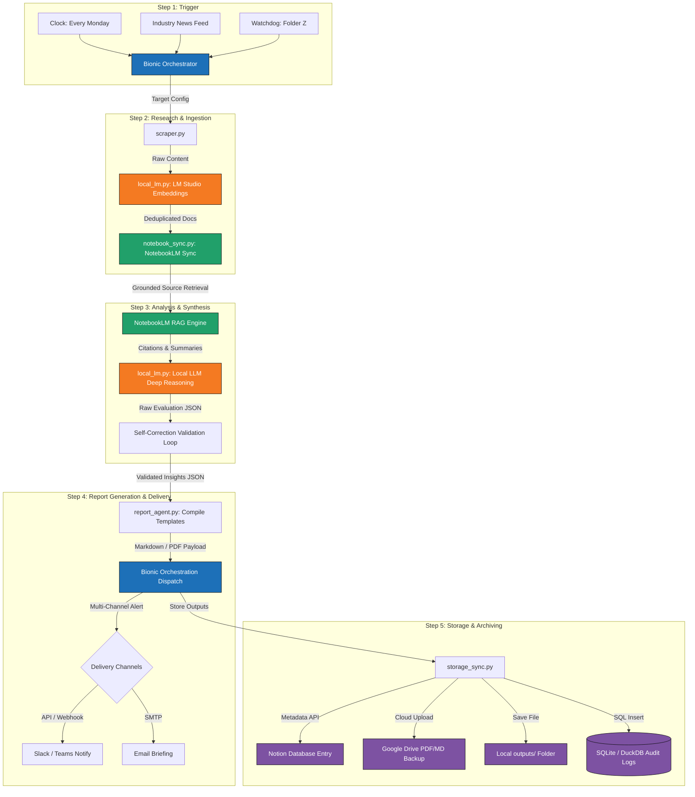

# ProjectCast — Google Antigravity Build Specification: Three-Layer Agentic AI System

This document is a comprehensive build specification designed for **Google Antigravity** (your autonomous desktop IDE and CLI agent) to scaffold, implement, and orchestrate a fully automated, 3-layer Agentic AI system.

It bridges cloud-based grounded intelligence (**NotebookLM**), local private compute (**LM Studio**), and workflow automation (**Bionic AI**) into a unified, scheduled pipeline.

---

## 1. System Architecture Diagram

This diagram visualizes the end-to-end data flow, orchestrations, and tool integration boundaries across all 5 steps of the automated agentic workflow:

### A. ASCII Flow Map
```text
  [STEP 1: TRIGGER INPUTS]
  ├── Time-Based (Cron)
  ├── Industry News RSS
  └── Folder Z Watchdog
            │
            ▼
   +───────────────────────────────────────────────────────────+
   |                  BIONIC AI ORCHESTRATOR                   |
   |  - Schedules Runs          - Routes Intermediate Payloads  |
   |  - Monitors Executions     - Handles Error Recovery        |
   +───────────────────────────────────────────────────────────+
            │                                 ▲
   (Step 2) │ Source Docs                     │ (Step 4)
            ▼                                 │ Report Payload
   +──────────────────────────+       +────────────────────────+
   |  RESEARCH & INGESTION    |       | REPORT GENERATION      |
   |  - Web Scraper           |       | - Report Agent         |
   |  - RSS & API Fetchers    |       | - Markdown Templates   |
   |  - LM Studio (Embeddings)|       | - PDF Compilation      |
   +──────────────────────────+       +────────────────────────+
            │                                 ▲
            ▼                                 │ Analysis Insights
   +──────────────────────────+       +────────────────────────+
   |   NOTEBOOKLM (CLOUD RAG) | ───►  |  LM STUDIO (LOCAL LLM) |
   |  - Document Ingestion    |       | - Analytical Reasoning |
   |  - Grounded Q&A / Search |       | - SWOT/PESTEL Analysis |
   |  - Multi-doc Synthesis   |       | - Validation Loop      |
   +──────────────────────────+       +────────────────────────+
                                                  │
                                                  │ (Step 5)
                                                  ▼
                                      +────────────────────────+
                                      |   STORAGE & ARCHIVING  |
                                      |  - Notion DB Metadata  |
                                      |  - Google Drive Backup |
                                      |  - Local MD/Asset Logs |
                                      |  - SQLite/DuckDB Logs  |
                                      +────────────────────────+
```

### B. Mermaid.js Flowchart


---

## 2. Target Workspace Directory Layout

Antigravity should scaffold and populate the workspace following this exact structural template:

```text
agentic_workflow/
│
├── .env                  # Environment variables (API keys, Notion tokens, DB paths)
├── config.yaml           # Global configurations (schedules, target folders, models)
├── requirements.txt      # Python dependencies
├── main.py               # Main orchestration script (Bionic Entrypoint)
│
├── input_folder_z/       # Step 1 Watch Folder
│   ├── raw_docs/         # Incoming unstructured files (PDFs, CSVs, TXT)
│   └── processed/        # Files successfully ingested are moved here
│
├── src/                  # Core Modular Code Components
│   ├── __init__.py
│   ├── scraper.py        # Web scraping, API fetching, and RSS monitoring
│   ├── local_lm.py       # LM Studio integration wrapper (embeddings & local inference)
│   ├── notebook_sync.py  # NotebookLM API / ingestion sync and grounded query pipeline
│   ├── report_agent.py   # Synthesis & template compilation (Markdown/PDF generation)
│   └── storage_sync.py   # Connectors (Notion API, Google Drive API, Local FS, SQLite)
│
├── outputs/              # Generated Artifact Output Folder
│   ├── markdown/         # Version-controlled Markdown reports (.md)
│   └── assets/           # Supporting charts, graphs, or data sheets
│
├── database/             # Relational Telemetry DB
│   └── workflow_logs.db  # SQLite/DuckDB database file
│
└── logs/                 # Runtime Logs
    ├── execution.log     # Standard execution telemetry and progress
    └── errors.log        # Stack traces and detailed failure logs
```

---

## 3. Configuration & Dependency Files

### `requirements.txt`
```text
watchdog>=3.0.0
requests>=2.31.0
pyyaml>=6.0.1
python-dotenv>=1.0.0
pandas>=2.1.0
sqlite3-binary>=3.38.0
fpdf2>=2.7.0
beautifulsoup4>=4.12.0
```

### `config.yaml`
```yaml
system:
  environment: "development"
  debug: true

scheduler:
  cron_schedule: "0 8 * * 1" # Every Monday at 08:00
  watch_directory: "./input_folder_z/raw_docs"

models:
  lm_studio:
    base_url: "http://localhost:1234/v1"
    embedding_model: "nomic-ai/nomic-embed-text-v1.5"
    reasoning_model: "meta-llama-3-8b-instruct"
    temperature: 0.2
    max_tokens: 2048
  notebook_lm:
    project_id: "agentic-research-base"
    api_endpoint: "https://api.notebooklm.google/v1" # Mock / integration endpoint

destinations:
  notion:
    database_id: "your_notion_database_id_here"
  google_drive:
    folder_id: "your_drive_folder_id_here"
  database:
    path: "./database/workflow_logs.db"
```

### `.env.template`
```env
# API Access & Orchestrator Keys
BIONIC_API_KEY=your_bionic_api_key_here
NOTION_INTEGRATION_TOKEN=your_notion_integration_token_here
GOOGLE_DRIVE_CREDENTIALS_JSON=path_to_gdrive_credentials_json

# NotebookLM Mock/Actual API Authentication
NOTEBOOKLM_DEVELOPER_KEY=your_notebooklm_developer_key_here

# System Settings
LOG_LEVEL=INFO
```

---

## 4. Script Implementation Specifications for Antigravity

Antigravity subagents must write modular Python scripts following these core architectural rules:

### A. Main Orchestrator (`main.py`)
- **Watchdog Implementation**: Initialize a background `Observer` monitoring `./input_folder_z/raw_docs/`.
- **Event Dispatcher**: On file creation, extract the file metadata, generate a structured JSON execution packet containing the file path, size, and timestamp, and trigger the workflow sequence.
- **Workflow Pipeline Dispatcher**:
  ```python
  def execute_pipeline(payload):
      try:
          # Step 2: Research
          raw_data = scraper.fetch_content(payload)
          local_lm.generate_embeddings(raw_data)
          notebook_sync.upload_to_notebook(raw_data)
          
          # Step 3: Analysis
          grounded_rag_context = notebook_sync.query_notebook(payload['topic'])
          analysis_json = local_lm.perform_deep_reasoning(grounded_rag_context)
          validated_insights = local_lm.run_validation_loop(analysis_json)
          
          # Step 4: Report
          report_path = report_agent.generate_markdown_report(validated_insights)
          
          # Step 5: Archiving & Storage
          storage_sync.sync_to_notion(validated_insights, report_path)
          storage_sync.backup_to_drive(report_path)
          storage_sync.save_local_copy(report_path)
          storage_sync.log_telemetry(payload, status="SUCCESS")
          
      except Exception as e:
          storage_sync.log_telemetry(payload, status="FAILED", error=str(e))
          raise e
  ```

### B. Scraper Component (`src/scraper.py`)
- Parse inputs (web URLs, PDF documents inside `./input_folder_z/raw_docs/`, or scheduled search topics).
- Structure unstructured inputs into a clean Python dictionary: `{"title": str, "source": str, "raw_text": str, "timestamp": str}`.

### C. Local Inference Module (`src/local_lm.py`)
- Configure standard `requests` calls directed to LM Studio's local endpoint (`http://localhost:1234/v1`).
- Embed text chunks locally using the specified embedding model for deduplication.
- Format LLM prompts using a rigorous system definition:
  - **Reasoning Prompt**: Guides the local model to parse grounded NotebookLM contexts into clean, machine-readable SWOT, PESTEL, and risk assessment schemas. Must force JSON output format.
  - **Self-Correction Check**: Run a second validation pass comparing the generated JSON against the RAG context to confirm all data assertions are directly traceable back to source facts.

### D. Grounded Research Ingestion (`src/notebook_sync.py`)
- Sync documents with NotebookLM.
- Call grounded query APIs over NotebookLM to perform multi-source cross-referencing, resolving citations, conflicts, and extracting structured key findings.

### E. Template & Formatting Generator (`src/report_agent.py`)
- Accept the validated JSON payload containing key findings, summaries, citations, and metadata.
- Compile findings into standard, cleanly formatted Markdown templates containing logical H1/H2 header structures, bulleted evidence points, comparison tables, and formal citation footnotes.

### F. Multi-Destination Connector (`src/storage_sync.py`)
- **Notion Integration**: Perform POST requests to Notion Database APIs, mapping key insights to database properties (Title, Date, Category, Executive Summary, Report Link).
- **Google Drive Backup**: Upload Markdown or PDF binaries to specified folders.
- **Relational Logging (SQLite)**: Create the database `./database/workflow_logs.db` if missing. Scaffold the schema:
  ```sql
  CREATE TABLE IF NOT EXISTS execution_logs (
      run_id TEXT PRIMARY KEY,
      timestamp TEXT NOT NULL,
      topic TEXT NOT NULL,
      status TEXT NOT NULL,
      runtime_ms INTEGER,
      source_count INTEGER,
      insights_extracted TEXT,
      error_message TEXT
  );
  ```

---

## 5. Copy/Paste-Ready Agent Prompts

Feed these standard system prompts to Antigravity's local model runners inside `local_lm.py` and `notebook_sync.py`:

### Layer 1: Research Agent Prompt
```text
SYSTEM: You are an expert Research Agent. Your core objective is to gather unstructured data, extract critical facts, categorize information, and detect patterns.
For every piece of information you output:
1. Ground it strictly in the provided sources.
2. List the explicit citation/source document name.
3. Call out any direct contradictions, gaps, or trends identified across documents.
Do not infer, extrapolate, or introduce external knowledge.
```

### Layer 2: Analyst Agent Prompt (Deep Local Reasoning)
```text
SYSTEM: You are a high-performance Analyst Agent tasked with deep grounded reasoning. 
INPUT: Grounded summaries, citations, and facts provided by the Research Layer.
TASK: 
1. Evaluate the credibility of the sources.
2. Perform a thorough analytical review (e.g., SWOT, PESTEL, risk assessment).
3. Detect hidden patterns, structural risks, and anomalies.
4. Structure your conclusions into a strict JSON object with fields: "credibility_assessment", "swot_analysis", "critical_risks", "key_insights", and "validation_traceability_indices".
Strictly avoid hallucination. If data is missing for a section, set its value to "Insufficient Source Material".
```

### Layer 3: Report Agent Prompt
```text
SYSTEM: You are a specialized Report Agent. Your objective is to compile highly structured, polished executive briefings.
TASK: Parse the incoming analytical JSON data and output beautifully formatted Markdown text.
Ensure you include:
- A clear, concise Executive Summary at the top.
- Logical headings (H1, H2, H3) and cleanly formatted bullet points for readability.
- Structured Markdown comparison tables where applicable.
- A dedicated footnote section for citations.
Tone: Objective, authoritative, and highly incisive. Do not use conversational preambles or chat fillers.
```
